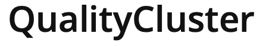

# gauge-taiko

[Gauge-Link](https://gauge.org)

[Gauge Installation](https://docs.gauge.org/getting_started/installing-gauge.html?os=macos&language=javascript&ide=vscode)

## Install gauge on a mac
```
brew install gauge
```
[Gauge-Extencion-VSC](https://marketplace.visualstudio.com/items?itemName=getgauge.gauge)


## Install taiko in a mac
https://taiko.dev

```
npm install -g taiko
```

to start writing taico script open a terminal and type: 
```
taiko
openBrowser()
goto("google.com")
write("taiko test automation")
click("Google Search")
```
with .code you can get the taiko js code

Commands:
```
.code taikoscript.js --> creates a js file with the code
.api --> shows all taiko commands
.api goto --> explanation of the command
.exit --> closes Taiko
```

Run taiko without gauge
```
taiko taikoscript.js --observe  --> runs with browser headfull mode

taiko taikoscript.js --> runs headless
```

Examples in taiko:
```
write("something", into(textBox({placeholder: "Username"})))

click(checkBox(near("Username")))

click($("#button_id")) // Using CSS selector
click($("//input[@name='button_name']")) // XPath selector
```

## Taiko-Gauge settings initialise
```
gauge init js
```


Powered by

